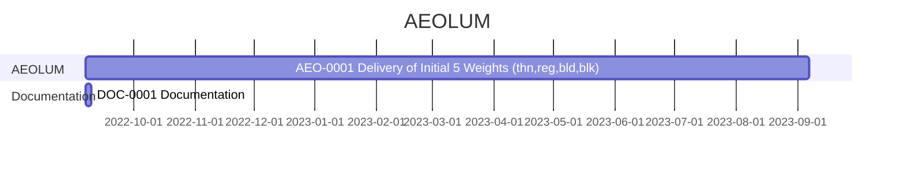

## **Preface**

**AEOLUM** Variable Font is an Open Source project of **VivaRado**.

<div markdown='1' class="header_logo">


</div>


##  **Introduction**

AEOLUM is the first Variable Font built using experimental tools like SYFF (Synthetic Font Functions), marketed using a web experience powered by ThreeJS and Web3 and funded by minting NFTs and your Sponsorships. Proving a viable for designers way to develop variable fonts.

#### Contributors:

*  VivaRado <support@vivarado.com>
*  Andreas Kalpakidis
*  Madina Akhmatova

---

### **Profile**
<sub>Introduction / Profile</sub>

<br>


*   Company: VivaRado LLP
*   Designer: Andreas Kalpakidis
*   Twitter: [@vivarado](https://twitter.com/VivaRado)
*   Google Group:[VivaRado Typography Google Group](https://groups.google.com/a/vivarado.com/forum/#!forum/typography)


---


### **Project Overview**
<sub>Introduction / Project Overview</sub>

<br>


*   Project Name: AEOLUM
*   Code Name: AEO
*   Test Type Family: AEOLUM
*   Proposal Date: 07/09/2022


---


### **Phase Introduction**
<sub>Introduction / Phase Introduction</sub>

<br>


For the sake of simplicity we will only present the following phases:

* Initiation Phase
* Planning Phase


---

### **Initiation Phase**
<sub>Introduction / Phase Introduction / Initiation Phase</sub>

<br>


*  **Initiation Phase** Components ∞0.001:
	
	1.  **Business Case**:
		*  Strategic case 
		*  Management case

---

### **Business Case**
<sub>Introduction / Phase Introduction / Initiation Phase / Business Case</sub>

<br>


#### We want to manage and fund and market the development of AEOLUM by using web3 technologies.

We see NFTs as both a funding and an access mechanism to our marketing material experience. A user or client can receive our design products directly without contribution to our funding. In the mean time we attempt to create a immersive experience for the ones who do participate in funding our Typography Department (TYDE). The 3D experience is accessible via [NFT Proof of Balance](https://github.com/VivaRado/NFT-Proof-of-Balance) by purchasing [$AEO](https://create.zora.co/collections/0xfd7ca4289770fba797957e37be66912fadce5d56). 


*  **Business Case** Components ∞0.001:
	1.  **Strategic case**
	1.  **Financial case**
	1.  **Management case**
		* Achievability


---

### **Strategic case**
<sub>Introduction / Phase Introduction / Initiation Phase / Business Case / Strategic case</sub>

<br>


The ability to have a set of simple looking instructions that reduce the repetitive nature of letters would increase the time spent on actually designing the look of the font and improve the time it takes to increase linguistic coverage and deploy the font. Most importantly you can still meddle with your font after the scripts are done doing what you told them.

---

### **Financial Case**
<sub>Introduction / Phase Introduction / Initiation Phase / Business Case / Financial Case</sub>

<br>


#### AEO Proof of Balance NFT

<div markdown='1' class="nft_thumb">

[](https://create.zora.co/collections/0xfd7ca4289770fba797957e37be66912fadce5d56)

</div>

[Minting this NFT](https://create.zora.co/collections/0xfd7ca4289770fba797957e37be66912fadce5d56) will serve as an access token to parts of the AEOLUM experience website, and helps with funding the development of the font and the tooling required to achieve that.


#### Github Sponsorship

We are also accepting sponsorships here on github.

<div markdown='1' class="sponsor_btn">

[](https://github.com/sponsors/vivarado)

</div>


---

### **Management case**
<sub>Introduction / Phase Introduction / Initiation Phase / Business Case / Management case</sub>

<br>


The management case tests the feasibility of the preferred option, in terms of its deliverability within various tolerances. 


#### Achievability:

We work around the product to achieve a smooth integration of all the parts, we have created [SYFF](https://github.com/VivaRado/SYFF) to help with combining letterforms in a distributed fashion that allows editability from files that look like CSS, we started developing the ThreeJS experience, the progress of which is on our [AEOLUM OpenSea collection](https://opensea.io/collection/aeolum), and we have managed to use [NFT Proof of Balance](https://github.com/VivaRado/NFT-Proof-of-Balance) as an access mechanism for said experience website. We think this will be a worth while journey for all of you who agree that this is a valid way to market, fund, develop type and type as art in line with web3 principles laid out in our [Digital Transformation booklet](https://opensea.io/collection/vrd) you can check that out on our [website](https://vivarado.com/api/metaverse?pack=en).


---

### **Achievements Plan**
<sub>Introduction / Phase Introduction / Initiation Phase / Business Case / Management case / Achievements Plan</sub>

<br>


1.  **Milestones**
	1.	Recombination Script
	1.  Synthetic Font Functions (SYFF Parsing)
1.  **Dependencies**
	1.  In Lib
1.  **Skillset Requirements**
	1.  Variable Font comprehension.
	1.  Python Programming
	1.  Web Application Development
	1.  Type Design
	1.	2D Vector Math


---

### **Project Charter**
<sub>Introduction / Phase Introduction / Initiation Phase / Project Charter</sub>

<br>


*  **Project Charter** Components ∞0.001:
	*  Project Introduction
	*  Project Goals
	*  Deliverables
	*  Duration

---

### **Project Introduction**
<sub>Introduction / Phase Introduction / Initiation Phase / Project Charter / Project Introduction</sub>

<br>


*  **Project Introduction** Components ∞0.001:

	*  Project Statements
		*  Vision Statement
		*  Mission Statement
	*  Project Definition
		*  Problem 
		*  Opportunity

---

### **Project Statements**
<sub>Introduction / Phase Introduction / Initiation Phase / Project Charter / Project Introduction / Project Statements</sub>

<br>


####  Vision Statement:
	
Prove new alternative tools and methods for font design and funding respectively.

####  Mission Statement:
	
Board the AEOLUM.


---


### **Project Goals**
<sub>Introduction / Phase Introduction / Initiation Phase / Project Charter / Project Goals</sub>

<br>


*  Goals for ∞ 1.00:
	*  Delivery of AEOLUM in 5 Weights
	*  Delivery of AEOLUM in Latin, Greek, Cyrillic
	*  Delivery of Variable AEOLUM


---


### **Deliverables**
<sub>Introduction / Phase Introduction / Initiation Phase / Project Charter / Deliverables</sub>

<br>


*  **Deliverables** Components ∞0.001:
	*  AEOLUM Font Instances
	*  AEOLUM Font Variable
	
---

### **Duration**
<sub>Introduction / Phase Introduction / Initiation Phase / Project Charter / Duration</sub>

<br>


*  **Duration** of AEO ∞1.00:
	*  Roughly 2022 to 2023.


---


### **Planning Phase**
<sub>Introduction / Phase Introduction / Planning Phase</sub>

<br>


The Planning Phase, is where the project solution is further developed in as much detail as possible and the steps necessary to meet the project’s objectives.
The project's **Work Plan / Project Plan** is created outlining the activities, tasks, dependencies, and timeframes.

The Planning Phase consists of:

1. **Project Plan**:
1. **Work Plan**:
1. **Schedule Plan**:
1. **Stakeholders**
1. **Quality Plan (PQP)**


---


### **Project Plan**
<sub>Introduction / Phase Introduction / Planning Phase / Project Plan</sub>

<br>


Decide on the encoding sets and supported language scripts. Decide and plan the weights and how you will generate each weight. Understand the procedures and steps. Calculate or keep track of timelines, steps procedures and pitfalls.

1.  **Project Plan** Components ∞0.001:
	1.  **Design**
	1.  **Production**
	1.  **Alteration Functions**

---

### **Design**
<sub>Introduction / Phase Introduction / Planning Phase / Project Plan / Design</sub>

<br>


BUMP

---

### **Production**
<sub>Introduction / Phase Introduction / Planning Phase / Project Plan / Production</sub>

<br>


BUMP


---

### **Usage**
<sub>Introduction / Phase Introduction / Planning Phase / Project Plan / Usage</sub>

<br>


####  **To apply the SYFF:**

Planned:

```python3 '/syff.py' -s '/font.designspace' -c '/font.syff' --output-path '/AEOLUM-VF.ufo'```

---

Current Test:

```python3 '/syff.py' -s '/demo.syff'```


---

### **Work Plan**
<sub>Introduction / Phase Introduction / Planning Phase / Work Plan</sub>

<br>


SYFF **Work Plan** is created outlining the activities, tasks, dependencies, and timeframes.

*  Work Plan:
	*  Tasks Assignments
	*  Dependencies

---


### **Task Assignments**
<sub>Introduction / Phase Introduction / Planning Phase / Work Plan / Task Assignments</sub>

<br>


*  **Docs Update**:
	*  VivaRado, Andreas Kalpakidis (∞1):
*  **SYFF**:
	*  VivaRado, Andreas Kalpakidis (∞1):

---

### **Dependencies**
<sub>Introduction / Phase Introduction / Planning Phase / Work Plan / Dependencies</sub>

<br>


BUMP

---

### **Schedule Plan**
<sub>Introduction / Phase Introduction / Planning Phase / Schedule Plan</sub>

<br>


Overview:





*  Current:
    *  **AEO-0001** / from September 07 2022 to September 07 2023, a very broad initial estimation:

<small>Strike Through Equals Completion</small>


Task Codes:

*  AEO-∞-∞: AEOLUM Test Font
*  DOC-∞-∞: Documentation


---

### **Timeline**
<sub>Introduction / Phase Introduction / Planning Phase / Schedule Plan / Timeline</sub>

<br>


-  **2022-09-07**: We have the initial form of SYFF and we can proceed to designing AEOLUM.


---


### **Stakeholders**
<sub>Introduction / Phase Introduction / Planning Phase / Stakeholders</sub>

<br>


We identify the **Stakeholders** by a **Personnel Plan** and create a **Communication Plan** to keep the **Stakeholders** informed.


*  **Stakeholders** Components:

	*  Applicable Stakeholders (Concious and Unconcious Entities):
		*  clients
		*  personell
		*  funders
		*  suppliers
		*  equipment
	*  Glyph Design Team (GyT)
	*  Kern Testing Team (KeT)
	*  Quality Assurance Team (QaT)
	*  Programming Team (PgT)


---


### **Personnel Plan**
<sub>Introduction / Phase Introduction / Planning Phase / Stakeholders / Personnel Plan</sub>

<br>


*  Personnel Plan
	*  Organizational Structure
		*  team members
			*  internal
				*  Andreas Kalpakidis (∞1)
				*  Madina Akhmatova (∞1)
	*  Responsibilities and Qualifications
		*  Project Management and Accounting: Madina Akhmatova (∞1)
		*  Planning, Development and Design: Andreas Kalpakidis (∞1)

---

### **Communication Plan**
<sub>Introduction / Phase Introduction / Planning Phase / Stakeholders / Communication Plan</sub>

<br>


*  Communication Plan
	*  Stakeholder Feedback Mechanisms
		*  Weekly Notifications
			*  Twitter
			*  LinkedIn
	*  User Feedback Mechanisms:
		*  <support@vivarado.com>

---


### **Quality Plan**
<sub>Introduction / Phase Introduction / Planning Phase / Quality Plan</sub>

<br>


A **Quality Plan** describes the activities, standards, tools and processes necessary to achieve quality in the delivery of a project.

We can now create a **Quality Plan** by identifying the valid **Quality Targets** we want to achieve. Identify the **Quality Policies** that will be required to achieve them. Identify how to do **Quality Measurement**. Lastly identify how to maintain quality with **Quality Management**.


*  **Quality Plan (PQP)** Components:
	
	1.  Quality Targets
	1.  Quality Management

---

### **Quality Targets**
<sub>Introduction / Phase Introduction / Planning Phase / Quality Plan / Quality Targets</sub>

<br>


**Quality Targets** we want to achieve and what are their **Acceptance Criteria**, **Quality Management Procedures**, for each **Applicable Category**

1.  Quality Targets Components:
	*  Acceptance criteria
	*  Quality Management procedures

---

### **Quality Management**
<sub>Introduction / Phase Introduction / Planning Phase / Quality Plan / Quality Management</sub>

<br>


**Quality Management**, the nature of the **Audits**, **Work Verification** by assigning responsible personnel for **Task Fulfillment** and **Task Checking**.

1.  Quality Management
	*  Audits
	*  Tool Scheduling
	*  Work Verification
		*  Task fulfillment responsible personnel 
			*  VivaRado
		*  Task checking responsible personnel
			*  VivaRado


---


### **Glossary**


**SYFF**: SYFF (Synthetic Font Functions), IPA: [/saɪff/ >= /sɪff/].

---


### **Reference**


**CSSUtils**: [cssutils on pypi.org](https://pypi.org/project/cssutils/)<br>
**SYFF**: [SYFF on github](https://github.com/VivaRado/SYFF)<br>
**NFT-POB**: [NFT Proof of Balance](https://github.com/VivaRado/NFT-Proof-of-Balance)<br>

